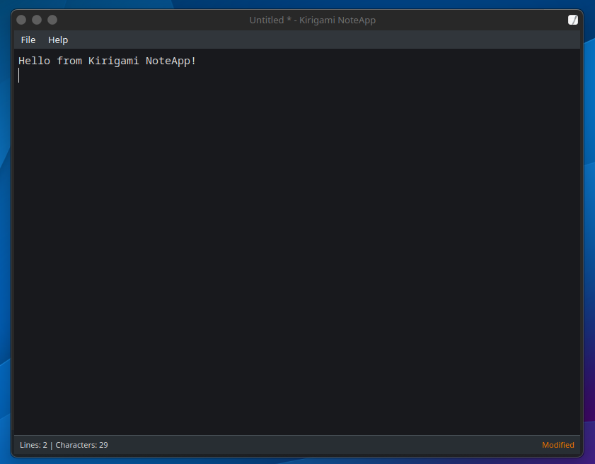

# Kirigami NoteApp

A minimal text editor for KDE built with Kirigami and Qt 6, inspired by Windows 7 Notepad.



## Features

- **Simple Text Editing** - Clean, distraction-free text editing interface
- **File Operations** - New, Open, Save, Save As functionality
- **Unsaved Changes Protection** - Prevents accidental data loss:
  - Prompts before quitting with unsaved changes
  - Prompts before opening a new file with unsaved changes
  - Prompts before creating a new document with unsaved changes
  - Three options: Save, Discard, or Cancel
  - Works with window close button and keyboard shortcuts
  - See [UNSAVED_CHANGES_FEATURE.md](UNSAVED_CHANGES_FEATURE.md) for details
- **Comprehensive MIME Type Support** - Intelligently detects and opens all standard text-based file formats:
  - Plain text files (text/plain, README, logs, etc.)
  - Programming languages (C/C++, Python, Java, JavaScript, QML, etc.)
  - Data formats (JSON, YAML, XML, TOML)
  - Build systems (CMake, Makefiles)
  - Documentation (Markdown, DocBook XML)
  - Configuration files (.desktop, .ini, .conf)
  - Web technologies (HTML, CSS)
  - Shell scripts (Bash, Zsh, etc.)
  - See [MIME_TYPES.md](MIME_TYPES.md) for the complete list
- **Smart File Type Detection** - Uses Qt's QMimeDatabase for accurate MIME type detection
- **Drag and Drop** - Drop any supported text file directly into the editor:
  - Empty editor: opens the file in the current window
  - Editor with content: opens the file in a new window
  - Automatic validation of text-based files
- **Desktop Integration** - Full integration with KDE/freedesktop.org:
  - Appears in "Open With" dialogs for supported file types
  - Can be set as default application for text files
  - Handles files from file manager and command line
- **Status Bar** - Shows line count, character count, and file status
- **Keyboard Shortcuts** - Standard shortcuts (Ctrl+N, Ctrl+O, Ctrl+S, etc.)
- **Auto-save Indicator** - Visual feedback for unsaved changes
- **Modern KDE Design** - Uses Kirigami components for a native KDE look
- **Command-Line Support** - Open files directly: `kirigami-noteapp file.txt`

## Requirements

- Qt 6.5 or later
- KDE Frameworks 6 (KF6CoreAddons, KF6I18n)
- Kirigami 6
- CMake 3.20 or later
- C++17 compatible compiler

## Building

### Quick Start

```bash
# Build and run
make run

# Or use the build script
./build.sh
```

### Manual Build

```bash
# Create build directory
mkdir build
cd build

# Configure and build
cmake ..
make -j$(nproc)

# Run
./kirigami-noteapp
```

## Installation

### Local Installation (Recommended)

Install for the current user only (no sudo required):

```bash
./install-local.sh
```

This will:
- Build the application
- Install to `~/.local/share/kirigami-noteapp/`
- Create a desktop entry as "NoteApp"
- Make it available in your application launcher

### Uninstall

```bash
./uninstall-local.sh
```

### System-Wide Installation

```bash
make install
```

Requires sudo. Installs for all users.

## Usage

### Opening Files

**From Command Line:**
```bash
# Open a specific file
kirigami-noteapp /path/to/file.txt

# Or after local installation
~/.local/share/kirigami-noteapp/kirigami-noteapp file.txt
```

**Drag and Drop:**
- Drag any text-based file from your file manager onto the editor window
- If the editor is empty, the file opens in the current window
- If the editor has content, a new window opens with the dropped file
- **Smart Detection:** Uses MIME type detection to identify text files
- Supports 50+ text file formats including:
  - Source code (.cpp, .py, .js, .java, etc.)
  - Data files (.json, .yaml, .xml, .toml)
  - Build files (CMakeLists.txt, Makefile)
  - Documentation (.md, README, .docbook)
  - Configuration files (.desktop, .conf, .ini)
  - And many more - see [MIME_TYPES.md](MIME_TYPES.md)

### Keyboard Shortcuts

- **Ctrl+N** - New file
- **Ctrl+O** - Open file
- **Ctrl+S** - Save file
- **Ctrl+Shift+S** - Save as
- **Ctrl+Q** - Quit

### Menu Bar

Standard menu bar at the top with:

**File Menu:**
- New - Create a new blank document
- Open - Open an existing text file
- Save - Save the current file
- Save As - Save with a new name
- Quit - Exit the application

**Help Menu:**
- About - Application information

### Status Bar

- **Left side** - Line and character count
- **Right side** - File modification status (Modified/Saved)

## Project Structure

```
kirigami-noteapp/
├── main.cpp                     - C++ application entry point (with FileIO backend)
├── main.qml                     - QML UI definition
├── CMakeLists.txt               - Build configuration
├── NoteApp.desktop              - Desktop entry with MIME type associations
├── Makefile                     - Convenience build commands
├── build.sh                     - Build and run script
├── run.sh                       - Quick run script
├── install-local.sh             - Local installation script
├── uninstall-local.sh           - Uninstall script
├── test-mime-detection.sh       - MIME type detection testing script
├── README.md                    - This file
├── MIME_TYPES.md                - Comprehensive MIME type documentation
├── UNSAVED_CHANGES_FEATURE.md   - Unsaved changes protection documentation
├── REFACTORING_SUMMARY.md       - MIME type refactoring summary
├── QUICKSTART.md                - Quick start guide
└── INDEX.md                     - Project index
```

## Development

Based on the Kirigami Hello World template. The application uses:

- **Qt Quick** for the UI framework
- **Kirigami** for KDE-style components
- **Qt Quick Controls** for standard UI elements
- **Qt Quick Dialogs** for file dialogs

## MIME Type Support

The application uses Qt's `QMimeDatabase` for intelligent file type detection. This ensures compatibility with all standard text-based MIME types in KDE and other freedesktop.org-compliant environments.

**Supported MIME type categories:**
- `text/*` - All text MIME types (plain text, markdown, source code, etc.)
- `application/json`, `application/x-yaml`, `application/xml` - Data formats
- `application/x-docbook+xml` - DocBook documentation
- `application/x-shellscript` - Shell scripts
- And many more - see [MIME_TYPES.md](MIME_TYPES.md) for details

**Testing MIME detection:**
```bash
./test-mime-detection.sh
```

## Notes

- Text files are saved with UTF-8 encoding
- File I/O is handled by a C++ backend (FileIO class)
- MIME type detection uses Qt's QMimeDatabase for accuracy
- Drag and drop supports 50+ text file formats with automatic validation
- Multiple instances can be opened simultaneously via drag and drop or command line
- Visual feedback (highlight border) when dragging files over the editor
- Proper error handling and file permissions
- Desktop integration for "Open With" functionality

## License

This is a sample application for educational purposes.

---

**Created**: 2025-10-13 | **Platform**: KDE 6
